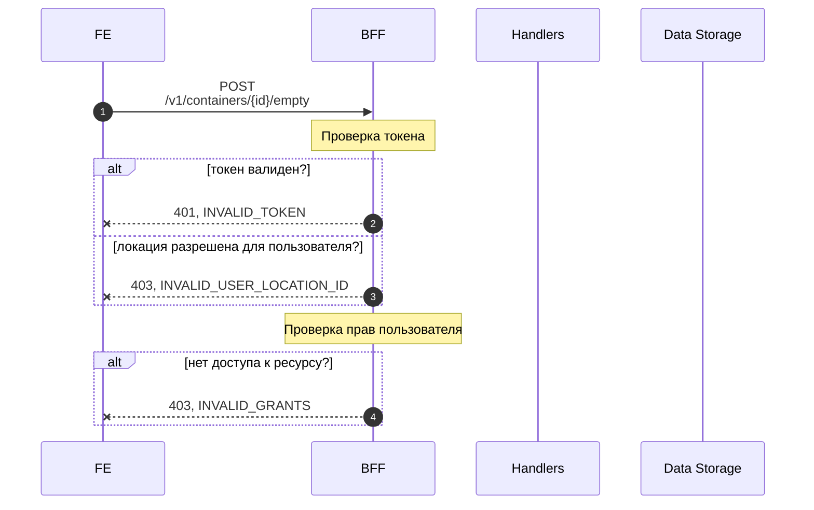

# Записки

#### [Новые возможности в NodeJS 18](./nodejs18-features/index.md)
#### [Книги](./books/Readme.md)

```mermaid
%%{init: 
{
  "theme": "dark",
}
}%%
sequenceDiagram
    autonumber
    participant FE
    participant BFF
    participant H as Handlers
    participant DS as Data Storage

    FE->>BFF: POST<br/>/v1/containers/{id}/empty
    note over BFF: Проверка токена
    alt токен валиден?
        BFF--xFE: 401, INVALID_TOKEN
    else локация разрешена для пользователя?
        BFF--xFE: 403, INVALID_USER_LOCATION_ID
    end
    note over BFF: Проверка прав пользователя
    alt нет доступа к ресурсу?
        BFF--xFE: 403, INVALID_GRANTS
    end
    activate BFF
```
